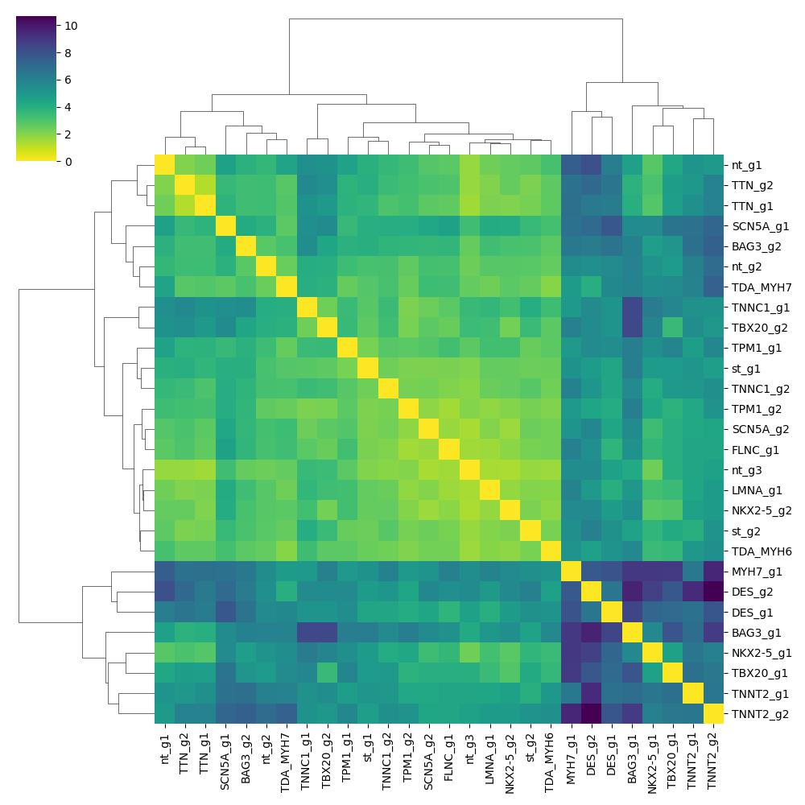
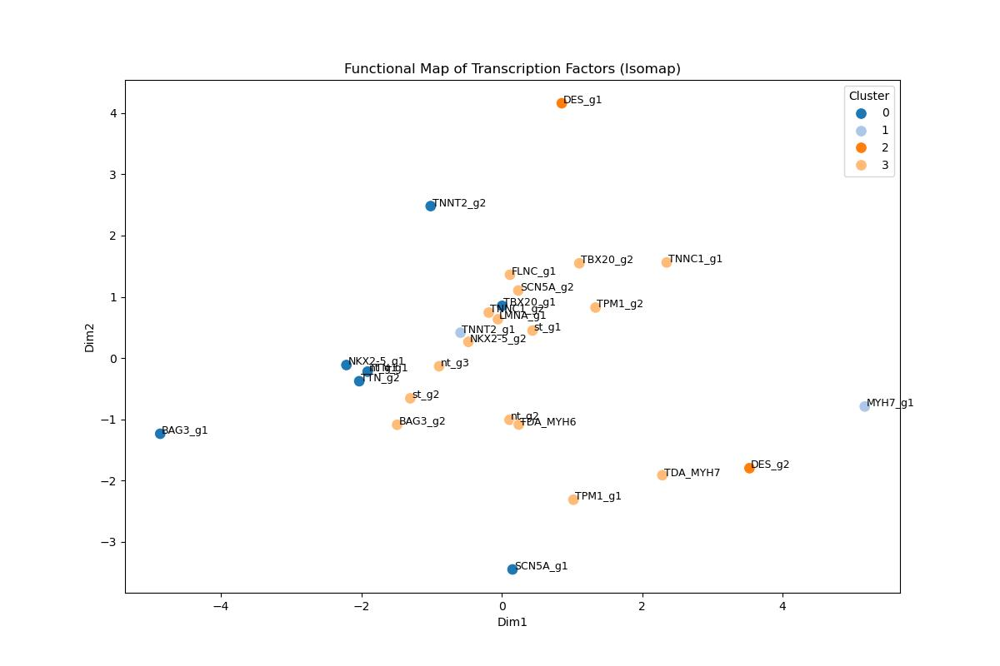

# Energy Distance Pipeline

This repository contains the analysis pipeline for calculating "Energy Distance" between single-cell populations, identifying significant perturbations, and clustering these perturbations based on transcriptomic differences. 

## Overview
The primary workflow is contained in `pipeline.ipynb`. The pipeline processes single-cell RNA sequencing data (stored as `.h5ad` AnnData objects) to measure the impact of CRISPR perturbations (or guides). 

### Key Steps in the Pipeline:
1. **Data Preprocessing & PCA:**
   Cells are normalized, and highly variable genes are scaled before running Principal Component Analysis (PCA) on all genes to obtain dimensionality-reduced cellular coordinates.
   
2. **Energy Distance Calculation:**
   Energy Distance, a statistical metric of distance between probability distributions, is calculated in the PCA space. It represents the divergence between the distribution of a specific perturbed cell population (e.g., specific gene guides) versus a control population (non-targeting `nt_` or safe-targeting `st_` guides).
   
3. **Permutation Testing:**
   Calculates p-values using an empirical permutation test to determine the statistical significance of the Energy Distance for each guide.
   
4. **Pairwise Distance Matrices:**
   Computes an Energy Distance-based pairwise distance matrix between different guides (or gene-level aggregated guides).

5. **Dimensionality Reduction & Clustering:**
   Performs MDS (Multidimensional Scaling) and Isomap on the pairwise distance matrices to visualize relationships between distinct guides. Further uses Affinity Propagation to discover clusters of guides that have similar transcriptomic phenotypes.

## Directory Structure
- `data/`: Contains the single-cell RNA-seq AnnData objects (e.g., `adata_ge1_HQstrict_guides.h5ad`) and differential expression results (`Koenig_DE.csv`, `chaffin_DE.csv`).
- `results/`: Contains the output distance metrics (e.g., `guide_control_distance.csv`) and various graphical visualizations. The results are divided into analytical subsets:
  - `all/`: Distance matrices and clustering over all guides.
  - `gene_wise/`: Analysis aggregated to the gene level.
  - `no_nt_st/`: Analysis with control guides (NT/ST) excluded.
- `pipeline.ipynb`: The primary Jupyter Notebook running the entire workflow.

## Example Visualizations

### Distance Matrix (Significant Guides)
Shows the hierarchical clustering of pairwise energy distances between guides that reached statistical significance.

### Isomap Clustering
Shows the projection of guides into a 2D Isomap embedding, clustered using Affinity Propagation.

### MDS Clustering (Gene-wise)
Shows the MDS embedding representation at the gene level.

## Requirements
- `scanpy`
- `pandas`
- `numpy`
- `scipy`
- `scikit-learn`
- `matplotlib`
- `seaborn`
